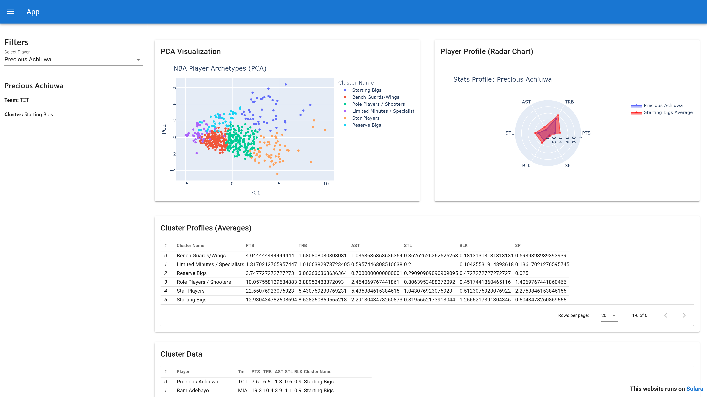
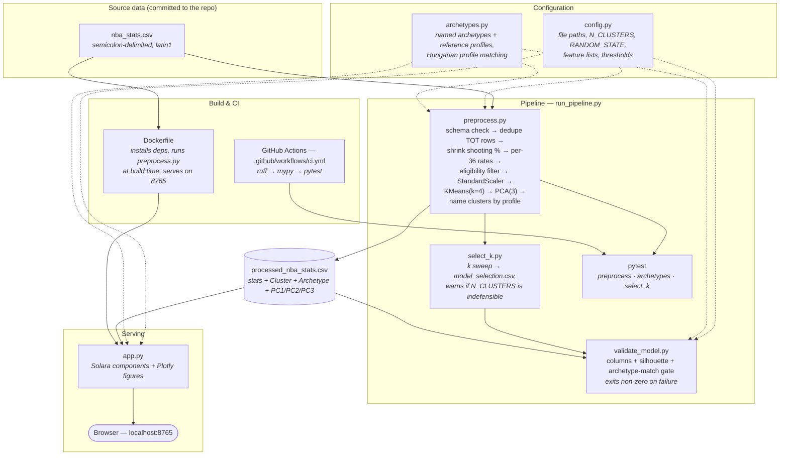
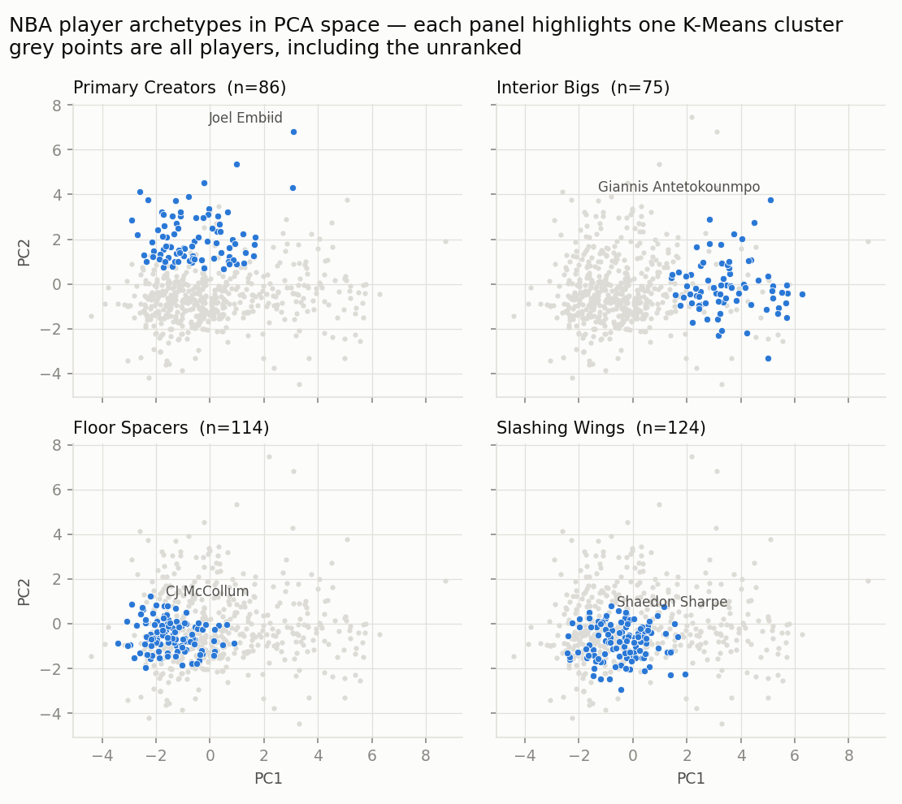
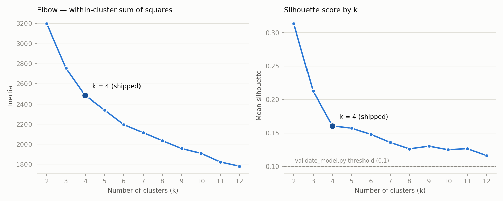
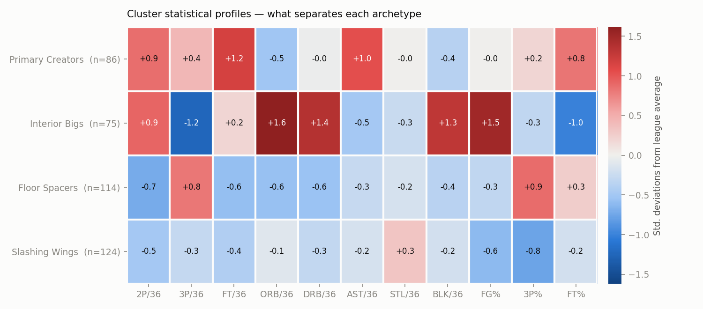

# NBA Player Clustering Dashboard

An interactive web application built with [Solara](https://solara.dev/) and [Plotly](https://plotly.com/) to cluster NBA players into four playing-style archetypes — **Primary Creators, Interior Bigs, Floor Spacers, Slashing Wings** — and visualize their profiles using radar charts.

## Tech Stack




*The dashboard at `http://localhost:8765` — pick a player in the sidebar and the PCA view, radar chart, and tables update reactively.*

## Features
- **Player Archetype Clustering**: Uses K-Means over per-36-minute rate stats to group players by *style* rather than by playing time.
- **Interactive PCA Visualization**: Explore the player space in 2D, with the selected player (and an optional comparison player) starred.
- **Radar Charts**: Compare individual player profiles against each other and against the cluster average.
- **Similarity Search**: Find the players closest to the selected one in scaled stat space.
- **Cluster Explorer**: Per-archetype descriptions, colors, and average stat lines.
- **Player Explorer**: Name search, team filter, and CSV download of the filtered table.
- **Reactive Dashboard**: Real-time player selection using Solara.

## Architecture



### How it fits together

`config.py` is the single source of truth for numeric parameters — feature lists, `N_CLUSTERS`, `RANDOM_STATE`, thresholds — so `preprocess.py`, `validate_model.py`, `app.py`, and the tests can't drift apart.

`archetypes.py` owns the *names*. See [Naming the archetypes](#naming-the-archetypes) below for why they aren't in `config.py`.

`preprocess.py` reads the committed `nba_stats.csv`, checks the required columns are present, collapses traded players onto their `TOT` (season-total) row, shrinks the shooting percentages toward the league rate (see [Shooting percentages](#shooting-percentages)), converts the counting stats to per-36-minute rates, then standardizes the 11 clustering features and fits `KMeans(k=4)` over the players who clear the [eligibility floors](#who-gets-clustered). It matches each resulting cluster to a named archetype, fits a 3-component PCA purely for visualization, and writes stats + `Cluster` + `Archetype` + `PC1/PC2/PC3` out to `processed_nba_stats.csv`.

`validate_model.py` is a gate, not a report: it re-scales the processed features, computes the silhouette score, re-derives the archetype match, and exits non-zero if the score falls below `SILHOUETTE_THRESHOLD` or a cluster no longer resembles the archetype it is labelled with. `run_pipeline.py` chains preprocess → validate → pytest and stops at the first failure.

`app.py` never re-fits anything. It loads `processed_nba_stats.csv` at import time and renders it — so serving is decoupled from training, and the dashboard starts instantly. The `Dockerfile` exploits this by running `preprocess.py` at *build* time, baking the processed CSV into the image so the container is ready to serve on start.

### Module responsibilities

| File | Responsibility |
|------|----------------|
| `config.py` | Shared configuration: input/output paths, `N_CLUSTERS`, `RANDOM_STATE`, eligibility floors, silhouette threshold, clustering/radar feature lists. |
| `archetypes.py` | Named archetypes, their descriptions, colors and reference statistical profiles, plus the profile-matching that assigns names to clusters. |
| `nba_stats.csv` | Committed raw input — per-game player stats (semicolon-delimited, `latin1`). |
| `preprocess.py` | Load → validate schema → dedupe traded players → shrink shooting percentages → per-36 rates → eligibility filter → scale → K-Means → PCA → name archetypes → write `processed_nba_stats.csv`. |
| `processed_nba_stats.csv` | Generated artifact consumed by both the validator and the app. Not the source of truth; regenerate it. |
| `validate_model.py` | Quality gate on the generated artifact: required columns present, silhouette score above threshold, archetype names still match their cluster profiles. Exit code drives CI/pipeline. |
| `run_pipeline.py` | Orchestrator — runs preprocess, validate, and tests in order, aborting on the first non-zero exit. |
| `app.py` | Solara dashboard: sidebar player/compare selectors, KPI strip, Plotly PCA scatter, radar chart, similarity search, cluster explorer, filterable player table with CSV export. |
| `select_k.py` | Sweeps k over the same matrix the model is fit on, writes `model_selection.csv`, and warns when the shipped `N_CLUSTERS` is no longer defensible. |
| `model_selection.csv` | Committed evidence for the chosen k: silhouette, inertia, smallest cluster, and seed stability per k. |
| `make_figures.py` | Regenerates the analytical figures in `docs/images/` from the processed data and `model_selection.csv`. |
| `test_preprocess.py` | Pytest suite over `preprocess_data` — output shape, no NaNs, cluster count, `TOT` collapsing, and error handling. |
| `test_archetypes.py` | Pytest suite over archetype naming — refits under four seeds and asserts the names track the cluster profiles. |
| `test_select_k.py` | Pytest suite over the k sweep and the defensibility checks it applies to `N_CLUSTERS`. |
| `Dockerfile` | Container build: install deps, run preprocessing at build time, serve on port 8765. |
| `.github/workflows/ci.yml` | CI on push/PR to `main`: `ruff check` → `mypy` → `pytest`. |

Regenerate the artifacts and figures after any model change so the numbers above stay true:

```bash
python preprocess.py && python select_k.py && python make_figures.py
```

## Model & clusters

These figures are generated by `make_figures.py` from the repo's own `processed_nba_stats.csv`.

### Where the archetypes sit in PCA space



*Each panel highlights one K-Means cluster against the full player population, unranked players included in grey. PC1 separates interior from perimeter play and PC2 tracks on-ball usage. Interior Bigs and Primary Creators occupy clearly distinct regions; Floor Spacers and Slashing Wings overlap here because what divides them is shooting accuracy, which loads on PC3. The three components together explain 68.8% of the variance in the 11 clustering features (PC1 37.5%, PC2 18.8%, PC3 12.4%) — `preprocess.py` logs this on every run. Faceting rather than four colors keeps the clusters distinguishable for colorblind readers.*

### Why k = 4



*The elbow is soft — box-score stats are a continuum, not naturally separated groups. Silhouette is highest at k=2 (0.31), but that just splits bigs from perimeter players. Within the interpretable range k=4 is the local maximum (0.1605 against 0.1571 at k=5), and it is the stable choice by a wide margin: mean ARI 0.98 across five seeds, smallest cluster 75 players. Stability collapses past k=6 — at k=8 the mean ARI is 0.47 and the smallest cluster holds 19 players.*

k was 6 until the sweep was made a real pipeline step; the value was inherited, not derived.

The sweep behind that figure is not *in* the figure script — a figure script only runs when someone regenerates PNGs, so k would never be rechecked. `select_k.py` owns it, runs as a pipeline step, and writes [`model_selection.csv`](model_selection.csv) as a committed artifact:

```bash
python select_k.py            # sweep, write the table, report
python select_k.py --check    # additionally exit non-zero if k is indefensible
```

Per k it records silhouette, inertia, the smallest cluster size, and **stability** — the mean adjusted Rand index between the shipped seed's partition and refits under four other seeds. Stability is the metric that actually matters for a project that attaches human names to clusters: if the partition isn't reproducible, neither are the names.

It then warns when the shipped `N_CLUSTERS` is no longer defensible: not at a local silhouette maximum, mean ARI below 0.75, or producing a cluster smaller than 2% of the player pool. The local-maximum test is applied from `INTERPRETABLE_K_MIN = 4` upward — silhouette is biased toward small k on continuum data, so comparing against the whole curve would recommend k=2 forever.

### Who gets clustered

Of the 572 player-seasons in the file, **399 are clustered and 173 are reported as `Unranked`**. The floors are `MIN_MINUTES_PER_GAME = 10.0` and `MIN_GAMES = 20`.

Clustering everyone used to manufacture an archetype out of sampling noise: a 47-player group averaging 6.7 minutes across 8.7 games, which is a sample size rather than a playing style. It also makes per-36 rates meaningless — a 4-minute cameo scales by a factor of nine.

Unranked players are not deleted. They keep their row, get PCA coordinates projected into the fitted space, and appear in the dashboard's tables and scatter in grey; they simply aren't given an archetype their minutes cannot support.

### Style, not playing time

The counting stats are converted to **per-36-minute rates** before scaling, and the aggregates are dropped in favour of their components. `CLUSTERING_FEATURES` is:

```
2P/36  3P/36  FT/36  ORB/36  DRB/36  AST/36  STL/36  BLK/36  FG%  3P%  FT%
```

Two problems this fixes:

**K-means on raw per-game totals is a volume sorter.** The old cluster mean minutes ran 6.7 / 10.6 / 11.6 / 24.1 / 27.2 / 33.9 — a five-fold spread. The partition was mostly a minutes ladder and PC1 tracked overall production, so the "archetypes" were really a depth chart. Under per-36 rates the spread across clusters is under 2×, and what separates them is shot profile and role.

**The feature set used to double-count scoring.** `PTS` is `2*2P + 3*3P + FT` and `TRB` is `ORB + DRB`, so including both the components and their sums (measured r = 0.92 for PTS/2P) weighted scoring volume roughly 4× and rebounding 2× against steals and blocks in the Euclidean distance — an implicit weighting nobody chose. The components are kept and fit; `PTS`, `TRB` and `MP` are kept as reported columns and shown throughout the dashboard.

### Shooting percentages

Basketball-Reference stores `0.0`, not NaN, for a player who never attempted a given shot — 46 players in this dataset have `3PA == 0` and `3P% == 0.0`, and the file contains no NaNs at all. Standardized, that is the strongest possible *negative* signal: k-means reads "took no threes" as "worst three-point shooter in the league". The mirror image is just as bad — one make in one attempt reads as a perfect shooter.

Both are small-sample artifacts, so `preprocess.py` shrinks every percentage toward the games-weighted league rate in proportion to the attempts behind it:

```
shrunk = (attempts * rate + k * league_rate) / (attempts + k)
```

with `k = SHOOTING_PRIOR_ATTEMPTS = 2.0` attempts per game. A player with no attempts lands exactly on the league rate (the honest "no data" value); a high-volume shooter moves by less than two percentage points.

### Naming the archetypes

K-Means cluster *indices* are an implementation detail. They depend on the random seed, on the sklearn version's initialisation, and on the data. Refitting this model with seeds 0/1/7/2024 moves the top scorer's cluster index to 3/0/0/0 while producing essentially the same partition (ARI 0.89–0.96) — so a hardcoded `{2: "Star Players"}` map would silently relabel every archetype in the dashboard, the figures, and this README the first time any of those changed.

Names are therefore never attached to indices. Each archetype in `archetypes.py` owns a **reference profile**: the mean of seven per-game signature stats (`MP`, `PTS`, `TRB`, `AST`, `STL`, `BLK`, `3P`), expressed in standard deviations from the league average, for the cluster a human originally looked at and named. After every refit, each fitted cluster is described in those same terms and matched to the reference profiles by minimum total distance — a bijection, via the Hungarian algorithm, so two clusters can never collapse onto one name.

The signature stats are deliberately *not* the clustering features: they're plain box-score columns that exist regardless of how `CLUSTERING_FEATURES` evolves. That decoupling has already paid for itself — the move to per-36 rates changed the feature list entirely without touching the naming machinery, and the gate below is what flagged that the old volume-based names no longer described the new clusters.

`validate_model.py` gates on the match. If any cluster sits further than `MAX_PROFILE_DISTANCE` (1.5 σ) from the archetype it was matched to, the pipeline fails rather than letting a genuinely new kind of cluster inherit a stale name. To inspect the current profiles:

```bash
python archetypes.py
```

### What separates each archetype



*Cluster means in standard deviations from the league average, over ranked players only. Each archetype is defined by a shape rather than a level:*

| Archetype | n | What defines it |
|---|---|---|
| **Primary Creators** | 86 | Highest `AST/36` (5.8) and `FT/36` (3.9); the on-ball engines. 30.7 MPG, 19.3 PPG. |
| **Interior Bigs** | 75 | Highest `ORB/36` (3.6), `DRB/36` (7.4), `BLK/36` (1.6) and `FG%` (.55); lowest `3P/36` (0.5). |
| **Floor Spacers** | 114 | Highest `3P/36` (2.7) and `3P%` (.38) outside the creators, with little interior involvement. |
| **Slashing Wings** | 124 | Score inside the arc rather than from it (`3P/36` 1.5 at .34); the least efficient group, `FG%` .44. |

*Note that the minutes columns are nearly flat across the four — Interior Bigs average 21.7 MPG and Floor Spacers 22.8, against 19.0 for Slashing Wings. That is the point: this is a partition of styles, not a depth chart.*

## Setup
1. Clone the repository:
   ```bash
   git clone https://github.com/thompgt/nba-player-clustering.git
   cd nba-player-clustering
   ```
2. Create and activate a virtual environment:
   ```bash
   python -m venv venv
   source venv/bin/activate  # On Windows: venv\Scripts\activate
   ```
3. Install dependencies:
   ```bash
   pip install -r requirements.txt
   ```

## Usage

### 1. Preprocess Data
If you have new data or want to re-run the clustering:
```bash
python preprocess.py
```

### 2. Validate Model
Run the validation script to check the silhouette score and cluster distribution:
```bash
python validate_model.py
```

### 3. Run Tests
Run the unit tests:
```bash
pytest
```

### 4. Run the Dashboard
```bash
solara run app.py
```
Then open http://localhost:8765.

### All of the above
`run_pipeline.py` runs preprocessing, the k sweep, validation, and the test suite in sequence, stopping at the first failure:
```bash
python run_pipeline.py
```

### Regenerate the README figures
Requires `matplotlib` (not in `requirements.txt` — the app itself doesn't need it) and a current `model_selection.csv`:
```bash
pip install matplotlib
python select_k.py
python make_figures.py
```

## Development

Install the dev dependencies and run the same checks CI runs:
```bash
pip install -r requirements-dev.txt
ruff check .
mypy preprocess.py validate_model.py run_pipeline.py config.py archetypes.py select_k.py
pytest -v
```

## Running with Docker
Build and run the dashboard in a container (preprocessing runs at build time, so the image is ready to serve immediately):
```bash
docker build -t nba-player-clustering .
docker run -p 8765:8765 nba-player-clustering
```
Then open http://localhost:8765.

## Data Source
The project uses NBA player per-game stats sourced from [Basketball-Reference](https://www.basketball-reference.com/), committed to this repo as `nba_stats.csv` so the pipeline runs end-to-end from a fresh clone with no manual data-fetch step.

The file is semicolon-delimited (`;`) with `latin1` encoding and includes, per player-season row: identity/context columns (`Rk`, `Player`, `Pos`, `Age`, `Tm`, `G`, `GS`, `MP`), traditional counting stats (`PTS`, `TRB`, `AST`, `STL`, `BLK`, `ORB`, `DRB`, `TOV`, `PF`), and shooting stats with makes/attempts/percentages (`FG`/`FGA`/`FG%`, `3P`/`3PA`/`3P%`, `2P`/`2PA`/`2P%`, `eFG%`, `FT`/`FTA`/`FT%`). Players traded mid-season have a `Tm == 'TOT'` row aggregating their full-season totals, which `preprocess.py` uses in preference to the per-team split rows.

To refresh with a newer season, replace `nba_stats.csv` with an equivalent export in the same format and re-run `python preprocess.py`.

## License
This project is licensed under the [MIT License](LICENSE).
