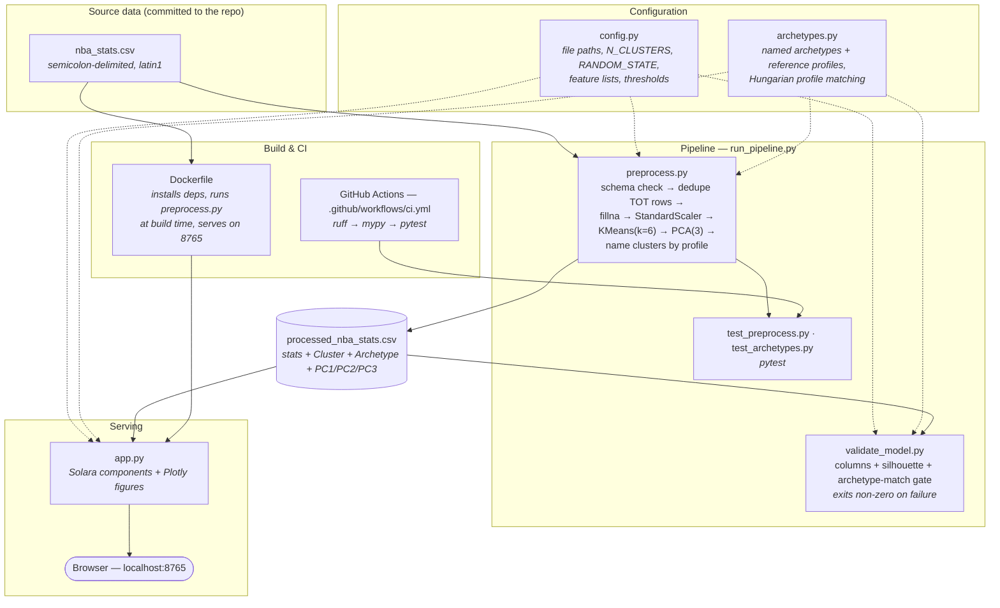

# NBA Player Clustering Dashboard

An interactive web application built with [Solara](https://solara.dev/) and [Plotly](https://plotly.com/) to cluster NBA players into archetypes based on their performance metrics and visualize their profiles using radar charts.

## Tech Stack


*The dashboard at `http://localhost:8765` — pick a player in the sidebar and the PCA view, radar chart, and tables update reactively.*

## Features
- **Player Archetype Clustering**: Uses K-Means to group players based on normalized stats.
- **Interactive PCA Visualization**: Explore the player space in 2D, with the selected player (and an optional comparison player) starred.
- **Radar Charts**: Compare individual player profiles against each other and against the cluster average.
- **Similarity Search**: Find the players closest to the selected one in scaled stat space.
- **Cluster Explorer**: Per-archetype descriptions, colors, and average stat lines.
- **Player Explorer**: Name search, team filter, and CSV download of the filtered table.
- **Reactive Dashboard**: Real-time player selection using Solara.

## Architecture



### How it fits together

`config.py` is the single source of truth for numeric parameters — feature lists, `N_CLUSTERS`, `RANDOM_STATE`, thresholds — so `preprocess.py`, `validate_model.py`, `app.py`, and the tests can't drift apart.

`archetypes.py` owns the *names*. See [Naming the archetypes](#naming-the-archetypes) below for why they aren't in `config.py`.

`preprocess.py` reads the committed `nba_stats.csv`, checks the required columns are present, collapses traded players onto their `TOT` (season-total) row, fills the shooting-percentage NaNs that mean "zero attempts", then standardizes the 13 clustering features and fits `KMeans(k=6)`. It matches each resulting cluster to a named archetype, fits a 3-component PCA purely for visualization, and writes stats + `Cluster` + `Archetype` + `PC1/PC2/PC3` out to `processed_nba_stats.csv`.

`validate_model.py` is a gate, not a report: it re-scales the processed features, computes the silhouette score, re-derives the archetype match, and exits non-zero if the score falls below `SILHOUETTE_THRESHOLD` or a cluster no longer resembles the archetype it is labelled with. `run_pipeline.py` chains preprocess → validate → pytest and stops at the first failure.

`app.py` never re-fits anything. It loads `processed_nba_stats.csv` at import time and renders it — so serving is decoupled from training, and the dashboard starts instantly. The `Dockerfile` exploits this by running `preprocess.py` at *build* time, baking the processed CSV into the image so the container is ready to serve on start.

### Module responsibilities

| File | Responsibility |
|------|----------------|
| `config.py` | Shared configuration: input/output paths, `N_CLUSTERS`, `RANDOM_STATE`, silhouette threshold, clustering/radar feature lists. |
| `archetypes.py` | Named archetypes, their descriptions, colors and reference statistical profiles, plus the profile-matching that assigns names to clusters. |
| `nba_stats.csv` | Committed raw input — per-game player stats (semicolon-delimited, `latin1`). |
| `preprocess.py` | Load → validate schema → dedupe traded players → scale → K-Means → PCA → name archetypes → write `processed_nba_stats.csv`. |
| `processed_nba_stats.csv` | Generated artifact consumed by both the validator and the app. Not the source of truth; regenerate it. |
| `validate_model.py` | Quality gate on the generated artifact: required columns present, silhouette score above threshold, archetype names still match their cluster profiles. Exit code drives CI/pipeline. |
| `run_pipeline.py` | Orchestrator — runs preprocess, validate, and tests in order, aborting on the first non-zero exit. |
| `app.py` | Solara dashboard: sidebar player/compare selectors, KPI strip, Plotly PCA scatter, radar chart, similarity search, cluster explorer, filterable player table with CSV export. |
| `make_figures.py` | Regenerates the analytical figures in `docs/images/` from the processed data. |
| `test_preprocess.py` | Pytest suite over `preprocess_data` — output shape, no NaNs, cluster count, `TOT` collapsing, and error handling. |
| `test_archetypes.py` | Pytest suite over archetype naming — refits under four seeds and asserts the names track the cluster profiles. |
| `Dockerfile` | Container build: install deps, run preprocessing at build time, serve on port 8765. |
| `.github/workflows/ci.yml` | CI on push/PR to `main`: `ruff check` → `mypy` → `pytest`. |

Regenerate the figures after any model change so the numbers above stay true:

```bash
python preprocess.py && python make_figures.py
```

## Model & clusters

These figures are generated by `make_figures.py` from the repo's own `processed_nba_stats.csv`.

### Where the archetypes sit in PCA space


*Each panel highlights one K-Means cluster against the full player population. PC1 tracks overall production and PC2 separates perimeter from interior play, so the archetypes occupy visibly distinct regions rather than overlapping blobs. Faceting rather than six colors keeps the clusters distinguishable for colorblind readers.*

### Why k = 6


*The elbow is soft — per-game box-score stats are a continuum, not naturally separated groups. Silhouette is highest at k=2, but that just splits starters from bench. Within the interpretable range, k=6 sits at a local silhouette maximum (~0.24) and yields six archetypes a basketball fan would recognize. Every k shown clears the 0.1 threshold `validate_model.py` enforces.*

### Naming the archetypes

K-Means cluster *indices* are an implementation detail. They depend on the random seed, on the sklearn version's initialisation, and on the data. Refitting this model with seeds 0/1/7/2024 moves the top scorer's cluster index to 3/0/0/0 while producing essentially the same partition (ARI 0.89–0.96) — so a hardcoded `{2: "Star Players"}` map would silently relabel every archetype in the dashboard, the figures, and this README the first time any of those changed.

Names are therefore never attached to indices. Each archetype in `archetypes.py` owns a **reference profile**: the mean of seven per-game signature stats (`MP`, `PTS`, `TRB`, `AST`, `STL`, `BLK`, `3P`), expressed in standard deviations from the league average, for the cluster a human originally looked at and named. After every refit, each fitted cluster is described in those same terms and matched to the reference profiles by minimum total distance — a bijection, via the Hungarian algorithm, so two clusters can never collapse onto one name.

The signature stats are deliberately *not* the clustering features: they're plain box-score columns that exist regardless of how `CLUSTERING_FEATURES` evolves.

`validate_model.py` gates on the match. If any cluster sits further than `MAX_PROFILE_DISTANCE` (1.5 σ) from the archetype it was matched to, the pipeline fails rather than letting a genuinely new kind of cluster inherit a stale name. To inspect the current profiles:

```bash
python archetypes.py
```

### What separates each archetype


*Cluster means in standard deviations from the league average. The structure is legible: Star Players are elevated across every counting stat; Starting Bigs spike on rebounding and blocks while sitting below average on 3P; Reserve Bigs share the interior shape at lower volume; and Limited Minutes / Specialists are uniformly negative, with FT% and FG% dragged down by tiny attempt counts.*

## Setup
1. Clone the repository:
   ```bash
   git clone https://github.com/thompgt/nba-player-clustering.git
   cd nba-player-clustering
   ```
2. Create and activate a virtual environment:
   ```bash
   python -m venv venv
   source venv/bin/activate  # On Windows: venv\Scripts\activate
   ```
3. Install dependencies:
   ```bash
   pip install -r requirements.txt
   ```

## Usage

### 1. Preprocess Data
If you have new data or want to re-run the clustering:
```bash
python preprocess.py
```

### 2. Validate Model
Run the validation script to check the silhouette score and cluster distribution:
```bash
python validate_model.py
```

### 3. Run Tests
Run the unit tests:
```bash
pytest
```

### 4. Run the Dashboard
```bash
solara run app.py
```
Then open http://localhost:8765.

### All of the above
`run_pipeline.py` runs preprocessing, validation, and the test suite in sequence, stopping at the first failure:
```bash
python run_pipeline.py
```

### Regenerate the README figures
Requires `matplotlib` (not in `requirements.txt` — the app itself doesn't need it):
```bash
pip install matplotlib
python make_figures.py
```

## Development

Install the dev dependencies and run the same checks CI runs:
```bash
pip install -r requirements-dev.txt
ruff check .
mypy preprocess.py validate_model.py run_pipeline.py config.py archetypes.py
pytest -v
```

## Running with Docker
Build and run the dashboard in a container (preprocessing runs at build time, so the image is ready to serve immediately):
```bash
docker build -t nba-player-clustering .
docker run -p 8765:8765 nba-player-clustering
```
Then open http://localhost:8765.

## Data Source
The project uses NBA player per-game stats sourced from [Basketball-Reference](https://www.basketball-reference.com/), committed to this repo as `nba_stats.csv` so the pipeline runs end-to-end from a fresh clone with no manual data-fetch step.

The file is semicolon-delimited (`;`) with `latin1` encoding and includes, per player-season row: identity/context columns (`Rk`, `Player`, `Pos`, `Age`, `Tm`, `G`, `GS`, `MP`), traditional counting stats (`PTS`, `TRB`, `AST`, `STL`, `BLK`, `ORB`, `DRB`, `TOV`, `PF`), and shooting stats with makes/attempts/percentages (`FG`/`FGA`/`FG%`, `3P`/`3PA`/`3P%`, `2P`/`2PA`/`2P%`, `eFG%`, `FT`/`FTA`/`FT%`). Players traded mid-season have a `Tm == 'TOT'` row aggregating their full-season totals, which `preprocess.py` uses in preference to the per-team split rows.

To refresh with a newer season, replace `nba_stats.csv` with an equivalent export in the same format and re-run `python preprocess.py`.

## License
This project is licensed under the [MIT License](LICENSE).
